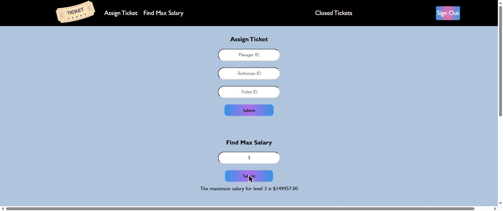
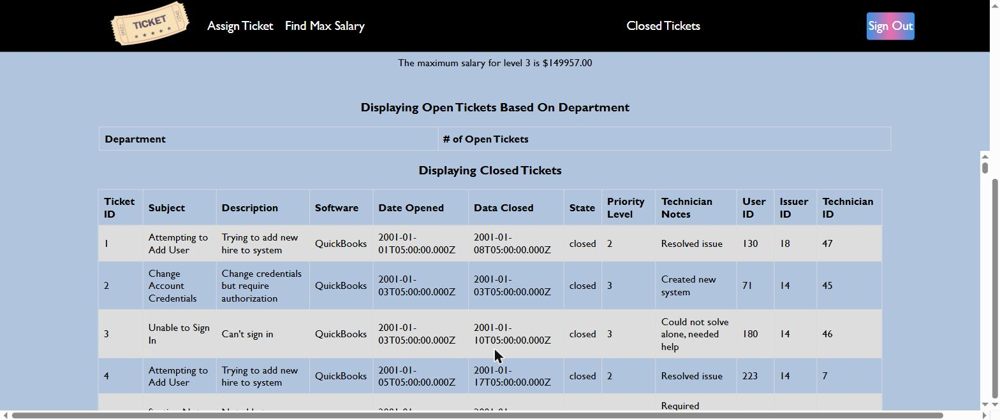

# Ticket Management System

An internal IT helpdesk — the system a company's support desk runs on. Employees file tickets about
the software they use, managers route those tickets to technicians, and technicians work them to
closed. Three roles, one login, and the interface changes depending on who you are.

The interesting part is the data model rather than the UI. It ships with a populated database:
4,500 tickets across 2,500 employees, 500 technicians, 200 issuers, 50 managers and 10 software
departments, with the assignment history to match. That is enough volume for the reporting queries to
be real queries — "which department has the most open tickets for which software" against 4,500 rows
is a GROUP BY that has to be written properly, not a toy.



## What it does

**One login, three interfaces.** You sign in with a username and password; the server works out which
of three tables you belong to and returns your role. The frontend then shows only the panels that
role is allowed to use:

| Role | What they get |
|---|---|
| **Issuer** | Create a ticket — subject, description, and which software it concerns |
| **Technician** | See their own open and in-progress tickets; update state and add technician notes |
| **Manager** | Assign a ticket to an available technician in a department; look up the top salary at an access level; view open tickets by department |
| **Everyone** | Browse all closed tickets |

**The ticket lifecycle.** An issuer opens a ticket against a piece of software. A manager assigns it
to a technician who works that department. The technician moves it through `open` → `In Progress` →
`closed` and leaves notes; closing it stamps the close date automatically. The seed data is mostly
worked history — 4,492 of the 4,500 tickets are already closed, with notes like "Resolved issue" and
"Could not solve alone, needed help".

**The API.** Eight route modules under `/api`, REST-ish and JSON throughout:

```
GET  /api/login/role/:username          which of the three roles this user is
GET  /api/login/:username/:password     authenticate, returns the employee record
GET  /api/ticket                        all tickets
POST /api/ticket/create                 open a ticket (validated)
PUT  /api/ticket/technicianEdit         update state and/or technician notes
GET  /api/ticket/allClosed              every closed ticket
GET  /api/ticket/departmentsMost        top 10 department + software by open ticket count
GET  /api/ticket/technicianTickets/:id  one technician's unfinished work
GET  /api/manager/availableTechs/:dept   who can take a ticket in this department
GET  /api/technician/maxSalary/:level    highest salary at an access level
POST /api/assigns/assignTicket           record a manager assigning a ticket to a technician
GET  /api/department  /api/user  /api/issuer  /api/manager  /api/technician
```

Writes are validated server-side with `express-validator` before they reach SQL — `POST /api/ticket/create`
rejects a non-integer user ID with `400 Invalid user ID.`, and `technicianEdit` constrains state to
the three legal values.

## Use case

A working reference for a small role-based CRUD app on a relational schema: seven tables with real
foreign keys and check constraints, a normalised design where `department` is keyed by name and
cascades on update, and an `assigns` join table recording which manager gave which ticket to which
technician.

The file worth reading is **`server/routes/ticket.js`** — it holds the whole lifecycle in one place:
validated creation, the three-way branch for updating state and/or notes, and the reporting query
behind `departmentsMost`. Next to it, `server/routes/login.js` shows the role resolution: three
sequential lookups, then a `UNION` across the three employee tables to authenticate against whichever
one matched.

## Tech stack

- **Node.js** + **Express 4** — REST API, eight route modules mounted under `/api`
- **MySQL 8** — seven tables, foreign keys, check constraints, `utf8mb4`
- **mysql2** — database driver, one shared connection on `global.db`
- **express-validator** — server-side validation on every write
- **dotenv** — the one secret (the MySQL password) comes from the environment
- **Vanilla HTML/CSS/JS** — no framework, no build step; `fetch` against the API, DOM toggling for the
  role views, served as static files by the same Express process

## Configuration

The server reads one environment variable. Copy the example and fill it in:

```
cp server/.env.example server/.env
```

| Variable | What it is | Where to get it |
|---|---|---|
| `ROOTPASS` | Password for the MySQL **root** user that `server/app.js` connects with | Whatever you set as the root password when you installed MySQL, or the value you pass as `MYSQL_ROOT_PASSWORD` if you run MySQL in Docker (below) |

`server/.env` is gitignored and must never be committed. The database host (`localhost`), user
(`root`) and schema name (`se3309`) are currently hardcoded in `server/app.js`; change them there if
your setup differs.

## Running locally

You need **Node.js 18+** and a **MySQL 8** server. Docker is the fastest way to get the database.

**1. Start MySQL and create the schema.**

```bash
docker run -d --name tms-mysql \
  -e MYSQL_ROOT_PASSWORD=localdevpass \
  -e MYSQL_DATABASE=se3309 \
  -p 3306:3306 mysql:8.0 --default-authentication-plugin=mysql_native_password

# wait for it to report ready, then load the schema and seed data
docker exec -i tms-mysql mysql -uroot -plocaldevpass se3309 < db/schema-and-seed.sql
```

Using a MySQL you already have instead? Create a database named `se3309` and load the same file into
it. Note that `db/schema-and-seed.sql` creates the tables in lowercase while one reporting query
(`/api/ticket/departmentsMost`) refers to them as `Technician` and `Ticket` — on a case-sensitive
MySQL (the default on Linux, including the Docker image above) that one endpoint returns a 500 until
the server runs with `lower_case_table_names=1`. Every other endpoint is unaffected.

**2. Configure and start the server.**

```bash
cd server
cp .env.example .env          # then set ROOTPASS to your MySQL root password
npm install
node app.js
```

It prints `Server running on port: 8080` and `Connected to database`.

**3. Open it.** Visit **http://localhost:8080** — Express serves the frontend from `web/` on the same
port. Sign in with any seeded account, for example the manager `brittanyenglish` / `1`, the seed
passwords are single digits.

**Verify the API directly:**

```bash
curl http://localhost:8080/api/department
curl http://localhost:8080/api/technician/maxSalary/3     # {"salary":"149957.00"}
curl http://localhost:8080/api/login/brittanyenglish/1
```



## Project layout

```
server/          Express API
├── app.js       connection, middleware, route mounting, static serving
├── routes/      8 modules — ticket, login, manager, technician, issuer, user, department, assigns
└── .env.example the one variable you need to set
web/             frontend — index.html, script.js, styles.css, served statically by Express
db/
└── schema-and-seed.sql   7 tables plus ~12,000 seeded rows; this is how you stand the app up
assets/screenshots/   screenshots of the running app
```

The seed data is synthetic throughout — generated names, emails, phone numbers and salaries. No real
personal data is in this repository.

## Credits

Built with a team of 5.

*Originally built as a course project at Western University.*
